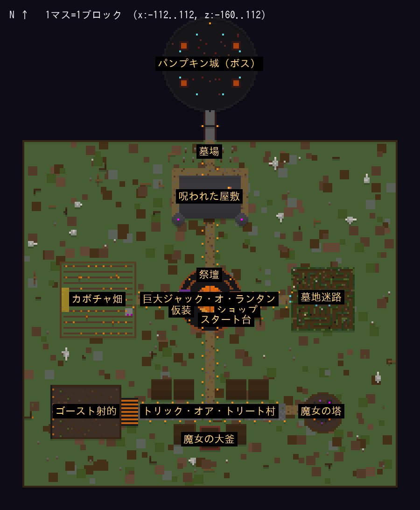

# ハロウィン・ナイト 〜パンプキン王の呪い〜

Minecraft Java版 **26.2** 用のハロウィン配布マップです（MODなし・データパックのみ）。
3人で遊んで YouTube で撮影する前提で作っています。お菓子をいちばん多く集めた人が優勝です。

## マップの中身

| エリア | 内容 |
|---|---|
| 広場 | 巨大ジャック・オ・ランタン（顔が光る）、HAPPY HALLOWEEN の看板、祭壇（ランタン3つを置く場所）、お菓子ショップ、仮装クローゼット（6種）、ルール掲示板、スタート台 |
| 呪われた屋敷（北） | 2階建て＋天井裏。ジャンプスケア4か所（暗転＋叫び声＋クリーキングが目の前に出現）。3冊の日記のヒントを読んで書斎のレバー（燭台）4本を正しく倒すと、天井裏への梯子が出る。天井裏に ①ランタン |
| 墓地迷路（東） | 11×11の生垣迷路、青い霧（ソウルサンドの谷バイオーム）、行き止まりに墓石。足元の感圧板7か所はワナでパンプキン頭のゾンビが湧く。中心に ②ランタン |
| カボチャ畑（西） | ミニゲーム「カボチャ狩り」: 60秒間、光るカボチャを叩く（金色は3点）。全員の合計20個で ③ランタンが出現。いちばん叩いた人を発表 |
| トリック・オア・トリート村（南） | 6軒の家をノック（1軒1回）。お菓子（2〜6個）・大当たり（12個＋花火）・いたずら（浮く／真っ暗／コウモリの大群／カボチャ頭の呪い） |
| 魔女の大釜（村の南） | お菓子3個で運だめし。スピード・力・再生・ジャンプ・暗視・透明・耐性、またはハズレ |
| 魔女の塔（南東） | 36段のらせんパルクール。チェックポイント2つ（落ちると自動で戻る）。頂上の宝箱でお菓子15個、ほうきで地上へ |
| ゴースト射的（南西） | 45秒間、弓（無限）で動くゴーストを撃つ。1体=お菓子1個、トップに+5 |
| パンプキン城（最北） | ランタン3つで城門が開く。ボス「パンプキン・キング」（巨大ウィザースケルトン、HP300、ボスバー）。手下召喚／魂召喚／衝撃波／背後にワープ、HP半分で怒り状態（かぼちゃ爆弾が追加）。倒すと全員+20、とどめ+30、花火 |
| マップ全体 | 隠しお菓子20個（光る粒で目印）、枯れ木と墓石、ずっと真夜中、ランダムな環境音、敵を倒すとお菓子（ゾンビ/スケルトン2、ゴースト1） |

ゲームの流れ: スタート台をクリック → ルール画面 → 5秒カウントダウン → 制限時間（初期40分）。
制限時間の半分で「ゴーストの襲来」、残り5分は「お菓子2倍タイム」。ボスを倒すか時間切れで終了し、順位・稼いだお菓子・やられた回数・隠しお菓子の発見数を発表します。優勝者には「パンプキン王の冠」と花火。

## 準備（どちらか）

### A. シングルプレイで作る（いちばん簡単）
1. Minecraft 26.2 で「ワールド新規作成」→ ワールドタイプ「スーパーフラット」→ プリセット「The Void（何もない世界）」、チートを「オン」。
2. 「データパック」画面に `halloween_night_datapack.zip` をドラッグして有効化し、ワールドを作成。
3. ゲーム内で `/function halloween:admin/build` を実行。チャットに「[建築] 1/22 …」と進み、「マップが完成しました！」で完成（数十秒）。
4. LAN公開すれば3人で遊べます。そのままワールドフォルダを zip すれば配布ワールドになります。

### B. サーバーで作る（PC の `C:\Users\kanek\Documents\ClaudeCode\halloween-map` を想定）
1. `pc-kit` の中身と `halloween_night_datapack.zip` を同じフォルダに置き、`setup.ps1` を右クリック →「PowerShell で実行」。26.2 の server.jar を公式から取得し、データパックを `world\datapacks` に置きます（EULA の同意だけ聞かれます）。
2. `start-server.bat` で起動、コンソールで `op <自分のID>`。
3. ゲーム内で `/function halloween:admin/build`。
4. 配布用 zip は、サーバーを `stop` してから `pack-world.ps1` を実行すると `dist\HalloweenNight_26.2_日時.zip` ができます（プレイヤーデータは除外）。

## 遊び方（撮影する人向け）
- 管理メニュー: `/function halloween:admin/menu`（チャットのボタンで 開始／終了して結果発表／リセット／制限時間 10〜60分／各エリアへワープ／暗視ON・OFF／ボス戦テスト）。
- カメラ役はスペクテイターモードにしておくと、参加者として数えられず、スコアにも入りません。
- 参加者はアドベンチャーモードで、ブロックは壊せません。キープインベントリ、即時リスポーン（広場）、PvPはオフ。
- 看板や物は右クリックでも左クリックでも反応します。
- もう一度遊ぶ時はスタート台を押せば、マップの状態（ランタン・城門・レバー・隠しお菓子）とスコアが自動で元に戻ります。

## 注意
- このマップはクラウド環境で作ったため、**まだ実際のゲームで動かしていません**。全5,435行のコマンドは 26.2 のコマンド定義・ブロック/アイテム/サウンド等の一覧と照合して構文エラー0を確認済みですが、エンティティのNBTの細かい挙動（ボスの強さ、ジャンプスケアの位置など）は実機での調整が必要になる可能性があります。本番前に一度通しで遊んでください。
- 建築中はマップ全体を常時読み込み（forceload）にしています。ゲーム中のギミックが遠くでも動くためです。

## ファイル
- `halloween_night_datapack.zip` … データパック本体
- `preview/` … 全体図と各エリアの立体図
- `pc-kit/` … サーバー用の設定・起動・配布zip作成スクリプト
- `src/` … データパックを生成する Python（`python3 gen.py out` で再生成、`validate.py` で構文チェック）。数値や配置を変える時はここを直して再生成します。
